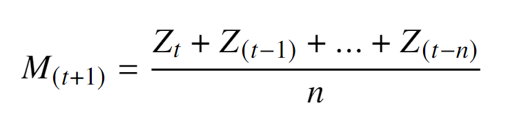
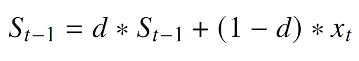

## Por que Aprender Sobre Séries Temporais?

No mundo moderno, a geração de dados em sequência temporal é contínua e abrangente. A cada instante, registramos informações em diversas áreas, como economia, demografia, meteorologia, e até mesmo em nossa vida cotidiana. A análise de séries temporais não apenas revela padrões, mas permite prever futuros eventos com base no comportamento passado, uma habilidade crítica para a tomada de decisões e o planejamento estratégico.

Imagine, por exemplo, a Fórmula 1, onde cada detalhe conta e as equipes utilizam séries temporais para analisar o desempenho dos carros ao longo de uma corrida. Com dados históricos de tempo por volta, velocidade, desgaste dos pneus e condições da pista, as equipes conseguem ajustar suas estratégias em tempo real. Analisando o comportamento dos pneus em diferentes voltas e condições, é possível prever o melhor momento para um pit stop, ou mesmo identificar uma tendência de queda de performance que pode indicar a necessidade de ajustes no carro. Esse tipo de análise pode ser a diferença entre ganhar e perder uma corrida.

Ou até mesmo, poder prever a demanda de produtos com base em vendas passadas ou antecipar mudanças climáticas utilizando dados históricos de temperatura e precipitação. Essas são algumas das aplicações práticas que tornam a análise de séries temporais uma habilidade valiosa. Compreender esses conceitos abre portas para um conhecimento profundo das variações e tendências ao longo do tempo, além de aprimorar nossa capacidade de resposta e adaptação a novos desafios.

Dominar essa área significa ir além do simples registro de dados: é compreender o que está por trás das variações e, consequentemente, extrair insights significativos para impactar o futuro. Aprender sobre séries temporais permite que utilizemos o passado como ferramenta, transformando dados históricos em informações que impulsionam a inovação e o progresso em diversos campos.

## Introdução às Séries Temporais

De acordo com Christopher Chatfield, séries temporais representam um conjunto de dados coletados sequencialmente ao longo de um período de tempo. Elas são amplamente utilizadas em campos como economia, demografia e meteorologia, onde a sequência temporal das observações é essencial para entender os fenômenos analisados.

A análise de séries temporais é especialmente relevante devido à sua capacidade de capturar relações de causalidade, permitindo que eventos passados forneçam informações valiosas para prever acontecimentos futuros. Esse tipo de análise é fundamental para apoiar o planejamento e a tomada de decisões em diversas áreas.

As séries temporais podem ser classificadas de diferentes maneiras. Quando os dados são registrados continuamente ao longo do tempo, temos uma série contínua. Em contrapartida, uma série discreta é composta por observações feitas em momentos específicos dentro de um período contínuo. Quando uma série discreta é obtida por meio da amostragem de uma série contínua — ou seja, extraindo valores em intervalos regulares de tempo — chamamos isso de sampled series (série de amostra). Já as séries agregadas são formadas a partir da combinação ou soma dos dados originais em intervalos de tempo maiores ou em grupos específicos, facilitando uma análise mais ampla, como, por exemplo, na medição da precipitação mensal.

### Características de uma Série Temporal

Para uma variável \( z \), sua série temporal é representada por \( Z_t \), onde \( t \) indica o tempo, com \( t=1 \) correspondendo ao primeiro valor e \( t=T \) ao último. Assim, o conjunto completo de tempos é dado por \( t=1, 2, ..., T \), geralmente dividido em intervalos regulares, como dias, horas ou minutos. A predição em séries temporais é feita através de um processo de regressão, cujo objetivo é identificar uma função alvo que se ajuste aos dados de entrada, minimizando o erro ao mapear cada atributo de \( Z \) para uma saída \( y \).

A **sazonalidade** é um padrão recorrente em uma série temporal que se repete em intervalos regulares ao longo do tempo, geralmente ligado a eventos naturais ou comportamentais que ocorrem de forma cíclica. Esses intervalos podem ser anuais, mensais, semanais ou até diários. A sazonalidade é comum em vários tipos de dados, como vendas, temperatura e consumo de energia.

A **tendência** em uma série temporal refere-se a uma mudança de longo prazo no nível médio dos dados, manifestando-se como um padrão consistente ao longo do tempo.

A **estacionariedade** é uma característica de uma série temporal que apresenta estabilidade em termos estatísticos: sua média e variância tendem a permanecer relativamente constantes ao longo do tempo. Uma série temporal é considerada estritamente estacionária se suas medições refletem um estado estável ao longo do período. Além disso, uma série pode ser estacionária de forma ampla ou apenas em intervalos curtos de tempo.

## Modelos Estatísticos

Quando falamos de séries temporais, a estatística entra em cena como uma ferramenta poderosa para nos ajudar a entender como os dados se comportam ao longo do tempo. Basicamente, ela nos permite descobrir padrões e tendências que podem não ser tão evidentes à primeira vista. Por exemplo, com a análise estatística, conseguimos identificar se as vendas de um produto estão aumentando em determinadas épocas do ano ou se a temperatura média de uma cidade está subindo ao longo das décadas. Usando modelos estatísticos, como ARIMA ou técnicas de suavização, podemos fazer previsões sobre o que esperar no futuro. Essa abordagem é super útil em áreas como economia, meteorologia e até mesmo nas redes sociais, onde entender as mudanças no comportamento dos usuários ao longo do tempo é fundamental. Então, se você está curioso sobre o que os dados têm a dizer, mergulhar de cabeça na estatística de séries temporais pode ser um ótimo caminho!

### Média Móvel
A Média Móvel (MM) é uma técnica que usa os valores médios de períodos passados para prever futuros. Basicamente, ela se baseia em entradas de um passado recente, o que significa que os valores atuais e futuros dependem apenas dos dados que já ocorreram. Por exemplo, em uma média móvel de sete dias, calculamos a média dos últimos sete dias. Quando um novo dia é adicionado à série, o primeiro dia é removido e o cálculo é atualizado. Isso ajuda a suavizar as variações, especialmente quando lidamos com dados que apresentam muito "ruído".

Além disso, a média móvel é uma ferramenta essencial na meteorologia. Meteorologistas utilizam essa técnica para analisar dados de temperatura e precipitação, o que os ajuda a identificar padrões climáticos e fazer previsões mais precisas sobre o tempo. Por exemplo, ao calcular a média das temperaturas diárias ao longo de uma semana, eles podem obter uma visão mais clara sobre as mudanças climáticas e preparar alertas para condições extremas.

O cálculo da média móvel, como podemos observar na equação abaixo, envolve a soma dos valores dos períodos anteriores e a divisão pelo número de períodos que estamos considerando. Por exemplo, se estivermos analisando uma média móvel de sete dias, somamos os valores dos últimos sete dias e dividimos por sete para encontrar a média do dia seguinte. Essa abordagem é super útil para entender tendências e prever o que pode acontecer a seguir, especialmente em dados que podem variar bastante ao longo do tempo.

Na fórmula da média móvel, **M(t+1)** representa o valor da média móvel no próximo período. **Z(t)** é o valor atual do dado no período, enquanto **Z(t-1)**, **Z(t-2)**, até **Z(t-n)** representam os valores dos **n** períodos anteriores. O parâmetro **n** define quantos períodos são considerados para o cálculo da média.

### Suavização Exponencial
A suavização em séries temporais é uma técnica usada quando queremos atribuir pesos diferentes aos dados, dando mais importância às informações mais recentes. Ao contrário da média móvel, que calcula uma média em torno dos dados ausentes, a Suavização Exponencial (SE) coloca mais peso nos dados mais recentes e menos nos mais antigos. Isso permite que as previsões sejam mais sensíveis a mudanças recentes nos dados, tornando-as mais relevantes para o que está acontecendo agora.

A suavização pode ser representada pela fórmula, onde **S(t)** é o valor suavizado ao longo do tempo **t**, **x_t** é o valor observado e **d** é o fator de suavização. Essa abordagem permite que os dados sejam ajustados de maneira que os valores mais recentes tenham um impacto maior nas previsões.

## Modelos de Aprendizagem de Máquina

O Aprendizado de Máquina (AM) é um campo da Ciência de Dados que utiliza métodos estatísticos e de otimização para permitir que os computadores analisem conjuntos de dados e identifiquem padrões. Essas técnicas aproveitam a mineração de dados para identificar tendências históricas e informar modelos futuros. 

Um algoritmo típico de aprendizado de máquina supervisionado envolve três componentes principais:

1. **Processo de decisão**: Uma série de cálculos ou etapas que recebem os dados e "adivinham" que tipo de padrão o algoritmo está procurando.
2. **Função de erro**: Um método para medir a qualidade da suposição, comparando-a com exemplos conhecidos (quando disponíveis).
3. **Processo de atualização ou otimização**: Um método em que o algoritmo analisa o erro e atualiza o processo de decisão, para que, na próxima vez, o erro não seja tão grande.

### KNR

O K-Neighbors Regression (KNR) é um algoritmo simples e eficaz que utiliza a técnica dos vizinhos mais próximos para prever valores contínuos. Nesse método, cada ponto de dado é representado como uma coordenada em um espaço multidimensional, onde as diferentes características do dado formam as dimensões. 

Quando um novo ponto precisa ser classificado ou ter seu valor previsto, o KNR calcula a distância entre esse ponto e todos os outros pontos no conjunto de dados. A métrica de distância mais comumente utilizada é a distância euclidiana, que mede a "reta" entre dois pontos. A partir dessa distância, o algoritmo seleciona os "k" vizinhos mais próximos e calcula a média dos valores desses vizinhos para fazer a previsão.

#### Exemplo Prático

Vamos imaginar que estamos tentando prever a classe de um novo elemento roxo com base nas características de elementos existentes. Suponha que temos um conjunto de dados que contém:

- 7 elementos da classe 1 (azuis)
- 7 elementos da classe 2 (verdes)

1. **Elementos Existentes:** No conjunto, temos 7 elementos azuis e 7 elementos verdes.

2. **Novo Elemento:** Precisamos prever a classe de um novo elemento roxo que está localizado em uma posição específica no espaço de características.

3. **Calcular Distâncias:** O KNR calcula a distância entre o novo elemento roxo e todos os elementos existentes.

4. **Selecionar Vizinhos:** Se escolhermos k=3, o algoritmo identifica os 3 elementos mais próximos do novo elemento roxo. Suponha que, entre os 3 elementos selecionados, 1 pertence à classe 1 (azuis) e 2 pertencem à classe 2 (verde).

5. **Previsão da Classe:** Com base na maioria dos vizinhos, o novo elemento roxo será classificado como classe 2 (verde), pois essa classe tem mais representantes entre os vizinhos mais próximos.

.png)

Fonte: [Geeks for Geeks](https://www.geeksforgeeks.org/k-nearest-neighbours/)

### Long Short-Term Memory (LSTM)

O LSTM, ou Long Short-Term Memory, é um tipo de rede neural recorrente projetada para aprender e reter informações ao longo de sequências de dados. Esse modelo foi desenvolvido para superar algumas das limitações das RNNs tradicionais, como a dissipação e a explosão do gradiente.

A arquitetura do LSTM inclui um neurônio com uma célula de memória e três portões: o portão de entrada, o portão de saída e o portão de esquecimento. A função desses portões é proteger as informações, controlando seu fluxo.

- **Portão de Entrada:** Esse portão decide quanta informação da camada anterior será armazenada na célula de memória.
- **Portão de Saída:** Esse portão determina quanto da informação armazenada na célula será transmitido para a próxima camada.
- **Portão de Esquecimento:** Esse portão decide quanto da informação de longo prazo deve ser considerado. Ele avalia o estado atual da célula e as entradas recebidas, permitindo que a rede neural descarte informações que não são mais relevantes ou úteis para o aprendizado.

Na estrutura do LSTM, os neurônios da camada de entrada são representados em amarelo, enquanto os neurônios da camada de saída estão em laranja. Os neurônios azuis representam as células LSTM, que utilizam informações de longo prazo para estimar novos valores. Os círculos presentes no centro das células LSTM ilustram o processo de como novas informações são integradas na célula atual para futuras estimativas.

Essa abordagem torna o LSTM uma ferramenta poderosa para tarefas que envolvem dados sequenciais, como previsão de séries temporais, análise de texto e reconhecimento de fala.

Fonte: [The Asimov Institute](https://www.asimovinstitute.org/neural-network-zoo/)

### Conclusão

As séries temporais desempenham um papel crucial na análise de dados, permitindo que compreendamos padrões ao longo do tempo e façamos previsões informadas sobre eventos futuros. Através de técnicas como a média móvel, suavização exponencial e algoritmos de aprendizado de máquina, podemos explorar e interpretar dados de maneiras que ajudam empresas e pesquisadores a tomar decisões mais estratégicas.

As aplicações práticas de séries temporais são vastas e incluem:

- **Previsão de vendas**: Empresas utilizam séries temporais para analisar tendências de vendas ao longo do tempo, permitindo ajustar estratégias de marketing e estoque.
- **Análise de mercado financeiro**: Investidores e analistas de mercado monitoram os preços de ações e outros ativos, ajudando a identificar padrões e tomar decisões de investimento informadas.
- **Monitoramento de condições climáticas**: As séries temporais são essenciais para prever mudanças no clima, ajudando em planejamento agrícola, gestão de recursos hídricos e resposta a desastres naturais.
- **Saúde pública**: Profissionais da saúde analisam dados de surtos de doenças ao longo do tempo, permitindo que identifiquem padrões e implementem intervenções efetivas.

Com a crescente disponibilidade de dados e o avanço das tecnologias, a análise de séries temporais se torna uma habilidade cada vez mais valiosa em diversas áreas. Investir tempo no entendimento e na aplicação dessas técnicas pode abrir novas oportunidades, possibilitando a transformação de dados em informações acionáveis. Portanto, independentemente do seu campo de atuação, considerar a análise de séries temporais como parte de sua estratégia de dados pode ser um diferencial significativo.
